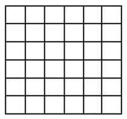

# Percolation on a Square Lattice

Undergraduate Dissertation by Gareth Flowers

1<sup>st</sup> Supervisor - Louise Richards

2<sup>nd</sup> Supervisor - Bernard Rayner

25/04/2005

# Abstract

Percolation theory has been used by mathematicians and physicists for over forty
years to describe the effects of disordered mediums. The analysis of these
mediums will undoubtedly require a great deal of knowledge in the mathematical
field of probabilities and algorithm. The generation of a lattice capable of
simulating a physical situation can be, at the best of times, tedious and time
consuming.

The generation of a computer simulation that will visually express and imitate
the effects of percolation on a given situation has previously been explored,
but in little detail. This project aims to construct a simulation package that
will create, analyse and visually explore a square lattice using percolation
theory. Stages of design and implementation will be detailed, and the success of
the product will be evaluated.

# Acknowledgements

There are numerous people that I would like to thank for their continued support
throughout my time at university and especially throughout my final year.

Fist and foremost I would like to express how grateful I am to Louise Richards,
who with her extensive knowledge has guided me through this dissertation on
percolation theory. Her help made me determined to persevere through the
difficult stretches of this dissertation.

I would also like to thank my mum and dad for their support of my schooling and
their commitment to help me succeed. Their constant enthusiasm, encouragement
and motivation has made a huge difference in the final outcome of this
dissertation.

A very big thank you also goes to my girlfriend who has been there throughout,
with her constant devotion and commitment. Her understanding towards my heavy
work load will always be appreciated.

# Table of Contents

# Table of Figures

-   <a href="#figure1">Figure 1, a square lattice before percolation</a>
-   <a href="#figure2">Figure 2, a square lattice after percolation</a>
-   <a href="#figure3">Figure 3, Site percolation</a>
-   <a href="#figure4">Figure 4, Bond percolation</a>
-   <a href="#figure5">Figure 5, a sample of regular lattices.</a>
-   <a href="#figure6">Figure 6, Linear Cluster.</a>
-   <a href="#figure7">Figure 7, Hyper-branched Cluster.</a>
-   <a href="#figure8">Figure 8, Dendrimer Cluster.</a>
-   <a href="#figure9">Figure 9, 2D percolation simulation</a>
-   <a href="#figure10">Figure 10, 2D percolation simulation</a>
-   <a href="#figure11">Figure 11, Waterfall Model</a>
-   <a href="#figure12">Figure 12, JBuilders syntax colouring and error
    reporting</a>
-   <a href="#figure13">Figure 13, Simple class diagram</a>
-   <a href="#figure14">Figure 14, Hierarchical Task Analysis for building a
    lattice</a>
-   <a href="#figure15">Figure 15, Interface structure chart</a>
-   <a href="#figure16">Figure 16, Generated lattice (size 30 by 30)</a>
-   <a href="#figure17">Figure 17, Output of results</a>
-   <a href="#figure18">Figure 18, Graph view of the simulation</a>
-   <a href="#figure19">Figure 19, the simulations 2D View</a>
-   <a href="#figure20">Figure 20, the simulations 3D view of a cluster</a>
-   <a href="#figure21">Figure 21, diagram of a virtual universe</a>
-   <a href="#figure22">Figure 22, a sample lattice and its results</a>
-   <a href="#figure23">Figure 23, Simulation performance times</a>

# Introduction

As more research is being done, the need for a computer simulation that
demonstrates the effects of percolation theory is growing. Percolation theory is
being implemented in increasingly more complex situations that require an
increased amount of computation.

This project will attempt to outline the construction of a simulation that may
be used by researches in the area of percolation theory. Focus will be given to
the design and construction of a square lattice (both in 2 and 3-dimensional
forms) that can be used to create a series of randomly formed clusters, by the
implementation of percolation theory. The stages of analysis and design will be
carried out to come up with an appropriate solution of conveying a broad range
of data associated with the lattice and its clusters.

Attempts will be made to create a graphical user interface that will enable a
user to generate a series of lattices of different sizes, from which results can
be processed.

The creation of a visual display of the lattice and cluster will also be tried.

# Context (Literature Review)

## 1.1 Percolation Theory

### 1.1.1 What is Percolation Theory?

> Percolation theory was developed to mathematically deal with disordered media.
> (Bentz, D.P. and Garboczi, E.J., 1991)

The theory of percolation has been used by mathematicians to look at the
connectivity features of a disordered material. The start of the theory is
usually associated with Broadbent and Hammersley s 1957 publication that
introduced the mathematical aspects of using geometrical and probabilistic
concepts <cite>(Stauffer and Aharony, 1994)</cite>. To describe percolation
theory it is often best to present an example that illuminates the most
important features, from which one can identify with the insights gained
obtaining a more formal definition Consider a large array of squares, known by
physicists as a square lattice, which most can physically identify with a large
sheet of graph paper. On this grid a random fraction of squares can be filled
with a dot, the remainder of which remain empty.



_**Figure 1**, a square lattice before percolation_


_**Figure 2**, a square lattice after percolation_

From this we can see that some of the squares are situated next to each other by
a common side, these are nearest neighbour sites, whereas squares connected to
each other by a corner are only next nearest neighbours. A cluster can then be
defined as a chain of nearest neighbour squares that are occupied by the dots.
Analysis of these clusters, particularly the numbers and properties of each,
form the basis of percolation theory. A cluster that spans the entire width,
height or depth of a lattice is known as a percolating cluster.

It is assumed that the initial distribution of points within the lattice is done
completely at random, and that changing the randomness will have an effect on
the distribution and subsequent formation of clusters within the lattice. We can
call the chances of a given site having a dot in it probability `p`, and so the
number of points occupied within the lattice will be `pN` (where is the total
number of squares). Percolating clusters are created when the probability
reaches a certain point, for example a square lattice such as this will create a
percolating cluster when `p` reaches 0.59 (<b>_p<sub>c</sub>_</b> &gt;= 0.59)
(Stauffer and Aharony, 1994).

There are two main types of percolation bond percolation, and site percolation
(Sahami, 1994). We have already dealt with site percolation (Figure 3), this has
been used in the previous example, where a whole square (or section of lattice)
is covered and connected to another section by one (or more) sides. Bond
percolation (Figure 4) is very similar we are concerned with only lines of the
lattice a dot is placed on the cross of two lines and a nearest neighbour is
joined by a connecting line, opposed to a side.


_**Figure 3**, Site percolation_


_**Figure 4**, Bond percolation_

Of course not all lattices are square and two-dimensional, this was just an
example A lattice is unrestricted in size and shape - depending on the
application of the theory (refer to section 1.1.2). Examples of several
different lattices are shown below in Figure 5.


_**Figure 5**, A sample of regular lattices. (A) The Bethe lattice. (B) The
honeycomb lattice. (C) The square lattice. (D) Kagom. (E) The triangular
lattice. (Diagram source: Sahami, 1994)_

### 1.1.2 Why use Percolation Theory?

The original mathematical literature (Broadbent and Hammersley, 1957) dealt with
the concept of the spread of hypothetical fluid particles through a random media
(Sahami, 1994). The terms fluid and media were invoked in the most general
sense, where fluid could be any liquid, gas, electric current etc., and the
media being a porous rock or forest etc. Percolation theory therefore offers a
means of mathematically evaluating and/or simulating a real world situation, for
example the spread of a forest fire, the distribution of oil or gas in oil
reservoirs (fractal oil fields) or the diffusion of two chemicals in a chemical
reaction.

The application of percolation theory to a situation provides a significant
number of benefits. The theory can be applied to a situation for which the cost
of reproducing physically is too expensive, i.e. testing new chemical reactions
and examining the distribution of oil in a new oil reserve, or to the
development of a new chemical that is highly dangerous or simply hard to
reproduce. For example you could simulate a forest fire, starting from a fixed
point (the initial fire) that grows exponentially from that point. The fire
would grow from a point in the lattice, setting fire to another point next to
it, then to another point next to that - forming a chain of fire that could
spread across the whole forest (a chain of points across the whole lattice -
i.e. a percolating cluster).

### 1.1.3 Analysis of Clusters

Once percolation theory has been applied to a given lattice, and that clusters
have been generated, created or identified then it is possible to create a list
of results that can be for analytical purposes. Each cluster within the lattice
has a set of properties that can be found by performing some mathematical
functions. The most common and useful of cluster analysis is detailed below.

-   **Percolating Clusters**

    Percolating clusters (or critical clusters as they are sometimes known) are
    clusters that span the entire lattice on which they are formed. A
    percolating cluster can easily be found by comparing the width, height or
    depth of the cluster to its corresponding value of lattice width, height or
    depth.

-   **Cluster Size**

    The cluster size is the total number of points within a cluster. This value
    is often referred to in other publications as cluster length or molecular
    weight.

-   **Width, Height (and Depth)**

    These values show the overall spread of a cluster. If used correctly they
    can give an impression of the shape of a cluster without a graphical
    representation.

-   **Centre of Mass**

    The centre of mass is a value that can be worked out for all three axis (x,
    y and d or alternatively width, depth and height). This value is a
    representation of the point of the midway point, on the associated axis,
    where there is an equal number of points on either side. The centre of mass
    is a useful measure as it is used to find the radius of gyration, below. The
    centre of mass of all three axis expressed as a vector (or coordinate)
    locates the precise point at which the entire weight of the cluster is
    considered to be situated.

    Centre of mass can be calculated by finding an average of each x, y, and z
    component of each point in the cluster.

-   **Radius of Gyration**

    This is the distance at which the entire area must be assumed to be
    concentrated in order that the product of the area and the square of this
    distance will equal the moment of inertia of the actual area about the given
    axis _(Wikipedia, 2005)_. It is essentially a value indicating the spread of
    points away from the centre of mass a large value indicates the cluster is
    spread out over a large distance, whereas a small indicates that the
    clusters points are packed closely together. This can often be compared to
    the mathematical function, Standard Deviation.

## 1.2 Monte Carlo Method

Monte Carlo simulation was named for Monte Carlo, Monaco, where most primary
attractions feature gambling and games of chance. Most games of chance exhibit
random behaviour, and this is similar to how the Monte Carlo method selects
values at random within a simulation There are two main types of Monte Carlo
methods simple and sophisticated (Everett and Carter, 1996). Simple methods are
used for the direct modelling of a random or chance process, whereas
sophisticated methods (including classical, quantum, path-integral and
volumetric) are generally used for more complex molecular computations.

The Monte Carlo method is often implemented in Percolation Theory because of the
randomness of cluster formation. As you can see from section 1.1.1 percolation
theory uses a random probability, `p`, of a site being occupied. The randomness
of such probabilities is crucial to the successful deployment of these sites. In
real situations there is often no way to determine how this randomness occurs,
so in order to model such situations effectively we need a method that a
reproduces true random numbers.

An example of Monte Carlo can be described in the roll of two die:

If you roll two dice, then the chances of getting _twelve_, that is a number
_six_ on each dice, are 1/36. However, if you did not know the answer, you could
use the Monte Carlo method to roll both of the dice hundreds of times, and
adding up how many times you got a total of twelve Eventually the ratio of
_twelve_'s to total number of roles will also be 1/36.

## Identifying Problems and Solutions

### 2.1 The need for a Solution

Percolation theory is used extensively in the theory of chemical reactions (at
the molecular level). When molecules of different chemicals are mixed together
they react to fmm chains (or clusters) of molecules. These molecules can be of
varying length and width (a large cluster size and distribution) and can be
branched a number of times. The molecules produced have different physical and
chemical properties, and are used for a variety of different applications.

There are three main types of molecules (clusters) produced:

-   **Dendrimers** - Have maximum branching. Every point of the molecule is
    branched as much as possible.
-   **Hyper Branched** - Have some branching.
-   **Linear** - Has no branching, it is just a straight chain of molecules.


_**Figure 6**, Linear Cluster._


_**Figure 7**, Hyper-branched Cluster._


_**Figure 8**, Dendrimet Cluster._

Dendrimers have special properties that make them good for use in things like
one- coat paint or dmg delivery. This makes these types of molecules very
desirable, although the manufacture of such Dendrimers can be very expensive. At
present most of the research that explores the properties of molecules created
during chemical reactions has been done either mathematically or physically.
Chemical reactions have been done in labs on a small scale, and mathematicians
have produced theoretical predictions as to the types of clusters (molecules)
fmm ed and their subsequent properties. In the process of a chemical reaction,
there are generally two or more chemicals present that react to form clusters of
molecules, often of varying length and size, the majority of these reactions
using all available substances present during the reaction. In terms of
percolation theory the reaction has run with the probability `p = 1`, this means
that every site within the given lattice (in the case the chemical contents) has
reacted and formed a bond with an adjacent site.

Although simulations based upon percolation theory have been produced, the
majority of them base their designs upon a 2D square lattice. Most simulations
are used to demonstrate the spread of forest fires, or similar situations, by
using percolation probabilities (`p`), as shown in section 1.1.1. There are very
few simulations that aim to visualise and apply the theory of percolation to an
entire lattice in both two and three dimensions. It would be useful to have a
program that simulates percolation theory - generating a lattice and analyse
several aspects of the clusters formed within it. This program could then be
used to collaborate results collected by mathematicians and physicists in order
to prove or disprove theory s given about a particular reaction (or other
situation).

### 2.2 Existing Solutions

There are only a few existing simulations that are based around percolation
theory. A search through popular internet search engines revealed a number of
existing simulations, largely based around JAVA and C++ languages. Theses
simulations mostly deal with square lattices on a two dimensional format.

One of these simulations has been developed by Christoph Adami to demonstrate
the probabilities at which a spanning cluster will appear in a two-dimensional
square lattice (see Figure 9). This solution is effective in providing the user
with a simple understanding in to the essence of percolation theory. Its layout
is basic and simplistic, providing the user with only the required level of
detail. This simulation uses site percolation with a probability factor that the
user can change - and allowing the user to interactively learn about the effects
of probability change (variance in `p`).


Figure 9, 2D percolation simulation.


Figure 10, 2D percolation simulation.

A second example, Figure 10, also of two-dimensional site percolation was
created by Dr. R.J. Consalves, which provides a more detailed view This java
applet provides details of cluster sizes and probabilities, as well as having
the extra options of dynamically resizeable lattices and probabilities. This is
beneficial because it enables the user to easily experiment with varying lattice
sizes and probabilities, in turn finding out about spanning clusters. This
simulation is personally more appealing as it has an increased level of
intuitiveness whilst providing the user with more visual feedback and
information.

### 2.3 Objectives

Simulations of percolation theory are mostly used by researchers and academics
to backup theory and practical work done whilst investigating a situation.
Whilst solutions have been made and constructed by other people (Adami, C. and
Consalves, R.J.) all have been made using two-dimensional site percolation, that
simply demonstrate the application of percolation theory in a given environment
This seems a common type of simulation to produce, and although effective in
demonstrating simple percolation it draws short of appropriately analysing and
outputting the results of cluster properties.

The aim of this project is to design and construct a simulation for percolation
theory based upon a square lattice. The product should be able to generate a
number of lattices at various sizes upon which some analysis can be performed.
To produce a textual and/or graphical representation will greatly help any
person attempting to apply percolation theory to a situation. Producing this
simulation program should therefore hope to fill the gap by creating a
meaningful simulation that can be used as an aid to researches.

# 3 Simulation Design

> A common mistake that people make when trying to design something completely
> foolproof is to underestimate the ingenuity of complete fools. _(Douglas
> Adams, 1981)_

The design of any program has always remained the single most important factor
when developing a system. A system which has been constructed with user
interaction in mind "will significantly contribute to end-system usability"
(Harmelan, 1999)"

Throughout the following design and implementation there are several terms that
should be noted. The term _node_ refers to a point on a lattice at which the
bond lines intersect, and the term _link_ refers to a bond between nodes.

## 3.1 Specifications

In order to produce a product that conforms to the requirements of the user a
specification must be drawn up. The specification is essentially a list of rules
to which the final product must meet. A brief overview of the problem situation
leads to the generalised specification list below.

-   A program should be made that will generate a blank lattice, upon which
    percolation theory may be applied at a given probability. This would then
    create a series of clusters that could be used to as a basis for some
    analysis.
-   Produce some analytical feedback to the user that will be both relevant and
    useful in the understanding and further research of percolation theory, e.g.
    radius of gyration, molecular weight distribution, using the previously
    developed lattice.
-   Produce a 3-dimensional representation of the lattice so that a user can
    view various parts of lattice in a way that is a more realistic
    representation of the theory.
-   This program would need to have a suitable graphical interface to enable
    users to easily view and understand the result set generated.
-   The possibility of being able to load and save results to a file. This would
    enable large lattices to be generated and then saved for analysis at a later
    time.

These basic points can be expanded upon to provide a well-detailed specification
that is to be used throughout the design stages.

### 3.1.1 GUI Specifications

The final specification as an enhancement of the general specification can be
listed as follows:

-   Generating a lattice of any size.
-   Applying percolation theory to the lattice to create a series of clusters
    (see lattice specification below).
-   Save the generated lattice to a file.
-   Load a saved lattice.
-   Analyse the clusters within the lattice finding radius of gyration,
    molecular weights.
-   Produce a textual output of the analysis.
-   Produce a representation of the lattice in a 3-dimensional form that can be
    viewed easily by the user.

### 3.1.2 Lattice Specifications

The lattice used within the main program must have its own detailed
specification.

This is important to ensure that the lattice is constructed and clusters formed
in a specific way. This specification is different to how previous examples
(Figure 9 and Figure 10) have generated lattices so it is important to realise
the differences. The lattice specification is listed as follows:

-   The lattice will be constructed using bond percolation (see page 3).
-   A square lattice will be used.
-   Each site location within the lattice must form a bond with another site,
    i.e. the lattice is run with probability `p = 1`.
-   Each location can only create one _outgoing_ bond.
-   Each location can have a maximum of two incoming bonds.
-   Closed loops are not allowed, that is a cluster cannot create a join back
    upon itself, in essence forming a loop.

## 3.2 Assumptions

Alongside the specification, there are a number of points that need to be
addressed that could have an impact on the system. Setting a series of
assumptions is important to reduce the risk of ambiguity and problems arising in
further stages of development.

-   Every time a random decision is supposed to be implemented then we can trust
    the programming languages random function to conform to the simple Monte
    Carlo method. Every execution of the random function has an equal
    probability and an equal chance of producing each number. For example, if a
    random selection of four options is needed then each option has a one in
    four chance of being selected.
-   Edges of lattices are negligible. In an ideal system there will be no edge
    to the lattice, the lattice will continue for billions of nodes in all
    directions As this is a simulation a line must be drawn to produce a cut off
    point, and creating an edge to the lattice. At the edge of the simulated
    lattice it is assumed that there is one (in 2-dimensional form) or two (in
    3-dimensional form) less nodes to link to. There is the possibility to
    further enhance the simulation at a later stage by changing this assumption
    and possible wrapping an edge round to meet its opposing side, in essence
    creating a continual loop, although this may be beyond the initial scope of
    this project.
-   Following on from the previous point, any node that is placed on an edge or
    corner still has the same equal probability of being linked as any other
    node contained within the lattice.

## 3.3 Methodology

A methodology is simply an organised and documented set of procedures for one or
more phases of the software life cycle, such as analysis or design. There are a
number of methodologies that can be used to control the design and
implementation of a product, i.e. the Waterfall model, v-model, each offering
its own benefits in the design stages. The waterfall method s key benefit is
that "it provides a good starting point for discussing the logical flow of
activity" (Dix, Finlay, Abowd, Beale, 2004), along with the fact that it allows
for fast development (has short production time) and little implementation
costs. This makes it an ideal candidate for use in this project. Downfalls to
this method include the lack of client input and evaluation of the product
throughout the development, though this may not be an issue in this case as the
project is not contracted to an outside client.


_**Figure 11**, Waterfall Model (Dix et al, 2004)._

## 3.4 Programming Languages

To develop a product that conforms to all of the specification it is important
to ensure that the right type of programming language is chosen. The range of
programming languages available for use in computer program design is quite
extensive although most choose to stick with the most popular and stable.

### 3.4.1 C++

> C++ is a general-purpose programming language with a bias towards systems
> programming that supports efficient low-level computation, data abstraction,
> object-oriented programming and generic programming. (Stroustrup, 1999)

C++ is an advancement on the original C language. C++ was designed to use the
power of C in Object Oriented Programming (OOP), whilst still maintaining speed
and stability. C++ is a common choice for developing simulations and games,
mostly due to its speed and power. It has a large base of methods and proven
high quality libraries that help add stability and power to an application.

### 3.4.2 Java

> The Java programming language lets you write powerful, enterprise worthy
> programs that run in the browser, from the desktop, on a server, or on a
> consumer device. ([java.sun.com](https://java.sun.com))

Java is now an extremely popular and powerful language that enables the
development of programs that can be run on servers, workstations, browsers and
consumer devices. A Java developed program is run from within a Virtual Machine
(VM) and as such can be run easily across most computer platforms (Windows,
UNIX, Mac, Linux). Java provides a separate API for building 3-dimensional
applications, which has been constructed especially to develop programs in 3D
easily.

> Java 3D allows developers to focus on what to draw, not how to draw (Gehringer
> and Walsh, 2002)

### 3.4.3 Visual Basic

> Visual Basic is an Object-Oriented Programming (OOP) language and a Rapid
> Application Development (RAD) environment from Microsoft. Visual Basic
> provides tools for Internet programming, and helps developers quickly create
> and deploy enterprise client/server applications, most often to access both
> local and remote databases. (Information Technology Toolbox Inc, 2002)

Visual Basic is a programming language built by Microsoft upon the BASIC
language. Although not a true OOP language, Visual Basic is often referred to as
such because of its event driven procedures. It is a lot simpler to use than the
previous two languages and is often used to develop quick and easy applications,
due to the ease of its drag and drop implementations, and because of this it is
known as a Rapid Application Development (RAD) system.

### 3.4.4 Choosing the Right Language

Although not an exhaustive list, the languages above are three choices readily
available for use at the time of development. Other languages could have
possibly been used (i.e. C, BASIC, C#, J#) and documented as suitable choices,
but it was felt that they would provide little or no significant improvement
over using one of the languages listed.

The first option would be to strike off Visual Basic from the list. Despite its
ease of development and the speed at which a program can be created, this
language offers no real benefits to a simulation program. It is both slower and
has little support for 3D programming.

For most, choosing the appropriate language for developing a simulation program
would be easy C++, which would obviously produce a program capable of running a
simulation at the fastest speeds. Speed, although the more common factor in a
simulation is not just the only aspect of programming language that needs to be
taken into consideration. The production of an easy to use, intuitive GUI is
essential to ensuring that the program is successful and considering the use of
a 3D visualisation of the lattice the use of a C language may not prove the most
efficient. Java offers the most attractive proposition in such a case. The
implantation of 3D java in combination with standard java will undoubtedly yield
best results. As far as speed is concerned, Java may not be significantly far
behind when generating small lattices but could possibly suffer when large
lattices are needed.

Despite possibilities of speed difficulties in large simulation results it was
decided that Java be used as the development language for the program This
language will be best because of the ability to combine the Java and Java 3D
Application Program Interface (API) in order to create a suitable interface,
whilst having capabilities of simulation and results analysis.

## 3.5 Software Tools

As the choice of programming language has now been selected, it is possible to
select the tools used to help develop the simulation. With Java being chosen as
the development language and Java 3D to provide the graphical aspects the use of
a dedicated Java Integrated Development Environment (IDE) was thought to be most
appropriate. The benefit of using such a tool is the ability of the program to
use syntax colouring (highlighting different java syntax in different colours)
to aid in program design, as well as an integrated compiler, and in some cases a
debugger. There are a large number of both free and commercial software
available that could assist this development by offering the features mentioned
previously. As we do not want to be paying large sums of money out for this one
simulation that choice was made to opt for a free IDE. A quick internet search
([www.google.co.uk](https://www.google.co.uk)) was made for Java IDE and the top
results where briefly reviewed for content, usability and features. The best
choices appeared to be JBuilder Foundation
([www.borland.com/jbuilder](https://www.borland.com/jbuilder)), BlueJ
(<a href="https://www.bluej.org">www.bluej.org</a>) and JCreator
(<a href="https://www.jcreator.com">www.jcreator.com</a>), and the final choice
was to use JBuilder as this provides a large range of features and integrated
compiling, and an added feature of error highlighting.


Figure 12, JBuilders syntax colouring and error reporting.

Developing Java software requires the installation of a Java Development Kit
(JDK) and a VM in order to build, compile and run any developed program As this
simulation will implement 3-dimensional java, the Java 3D API will also be
required.

The following versions were used for this development, accessible from
[java.sun.com](https://java.sun.com).

-   Java JDK 5.0 Update 2 (including JVM)
-   Java 3D 1.3.1

## 3.6 Designing the System

The design of good system is vital to ensuring the simulation is a success The
simulation must adhere to all statements in the specification, as well as
ensuring that it is usable and produces the required results.

The initial system can be split into three main sections:

-   lattice construction and generation
-   cluster analysis and result reporting
-   3-dimensional (and possibly 2-dimensional) lattice visualisation

All these sections should be run from a central interface as shown in the simple
class diagram below.


Figure 13, Simple class diagram.

### 3.6.1 Lattice Generation & Percolation

The lattice design is probably the single most important feature in the
development of this project. Since the entire simulation is based around a
square lattice it is vital that a lattice be created that accurately depicts the
state in which a lattice should be in relation to a real world situation.

To help aid the production of lattice the following hierarchical task analysis
has been performed and can be seen in Figure 14.

Using the task analysis we can see the order of events that need to be performed
to generate a lattice. It is important to observe the specifications constructed
in section 3.1.2, previously, upon the generation of the lattice.

These events are listed below in detail (bulleted numbers refer to the event
number in the hierarchical task analysis).

<ol>
	<li>
		<p>An initial lattice must be built. This should be an array of
			nodes (known subsequently as the nodes array) initially set to
			the required lattice size squared for a 2-dimensional lattice,
			or to the lattice size cubed for a 3dimensional lattice. As well
			as constructing a nodes array the construction of a clusters
			array, that is of equal size, is also required. The nodes array
			is used to store the _to_ node, and the clusters array
			stores the cluster number to which the node is assigned.</p>
		<p>e.g. for lattice size 200 the array would have to be:</p>
		<ul>
			<li>2D - 200<sup>2</sup> = 40000</li>
			<li>3D - 200<sup>3</sup> = 8000000</li>
		</ul>
		<p>Each of the nodes within the array is a reference to a single
			node on the lattice.</p>
	</li>
	<li>
		<p>A link must be added between two nodes on the lattice by using
			the following steps.</p>
		<ol>
			<li>
				<p>A node must be chosen at random. This random node should
					be chosen according to the rules of the simple Monte
					Carlo method (that is that there is an equal probability
					of any node being chosen), refer to section 1.2 for more
					information. If this node has not already got an
					outgoing link to another node then we can continue to
					stage 2.2.</p>
			</li>
			<li>
				<p>A suitable check needs to be made to see if any of the
					surrounding nodes are available to form a link to. On a
					2-dimensional lattice the checks need to be made to the
					nodes directly to the left, right, upper and lower of
					the random nodes. In the 3-dimensional lattice the check
					needs to also to the nodes in front and behind the
					random node. The check is to see whether the value of
					the array at the random node value is empty or not. The
					check on each of these nodes is to search the entire
					nodes array to see how many _from nodes_ link to
					that check node. If the number of _from nodes
					_linking to the check node is equal to or greater
					than the value detailed in the specification (two) then
					the check node is no good and must be discarded.
					Otherwise, if there are less than two nodes linking to
					it, the check node is good and can be used in the next
					stage.</p>
			</li>
			<li>
				<p>After 2.2 has been performed there should be several good
					or bad nodes listed. A random choice is again needed to
					select one of the good nodes. The random choice should
					again conform to the simple Monte Carlo method and apply
					equal probabilities of each good choice being chosen.
				</p>
			</li>
			<li>
				<p>Once the chosen node has been selected then a link can be
					created. This is recorded in the nodes array by settings
					the value at the index of the _from_ node to the
					_to_ node.</p>
				<p>e.g. if node 10 is connected to node 9 then: nodes array
					(10) = 9</p>
			</li>
		</ol>
	</li>
	<li>
		<p>Event number three assigns cluster numbers to each of the nodes,
			immediately after a link has been added. The cluster number
			determines the cluster group to which that specific node
			belongs.</p>
		<ol>
			<li>
				<p>The first step of this group of sub events is to
					determine if the node has a cluster number assigned to
					it. Each node has a corresponding cluster number in the
					clusters array. If the value of clusters array at index
					_node from_ is empty the node has not yet been
					assigned a cluster. If the clusters array contains a
					value then this is to be used as the current cluster
					number on event 3.3.</p>
			</li>
			<li>
				<p>If in event 3.2 the cluster number does not exist (the
					clusters array value is empty) then the highest cluster
					number within the clusters array must be chosen and
					incremented by one for use in event 3.3.</p>
			</li>
			<li>
				<p>Using the cluster number that was got from either event
					3.2 or 3.3 the value should be assigned to the clusters
					array index _node from_.</p>
			</li>
		</ol>
	</li>
</ol>

As you can see for the task analysis events two and three loop continuously
until each of the nodes has had a link and cluster number assigned to it
Following the whole process through should create a lattice with a series of
randomly produced links (using Monte Carlo method), that form groups of links
(clusters).


Figure 14, Hierarchical Task Analysis for building a lattice.

## 3.7 User Interface

> The aim of HCI should be to build computer applications that are jargon free
> and easy to use to the degree that all the user sees is the task and not the
> computer system at all
>
> <cite>Faulkner, 1998</cite>

A successful user interface is one that can be used easily by the user to
complete the job in hand. Human Computer Interaction (HCI) is used to study the
interaction of users and computers and to help determine good principles of
design and can often provide suitable rules to adhere to Schneiderman's (1998)
golden rules of user interface design help provide designs with a clear-cut list
of objectives that will help aid the design of an interface.

Schneiderman's Eight Golden Rules of Interface Design:

1. Strive for consistency.

    Consistent sequences of actions should be required in similar situations;
    identical terminology should be used in prompts, menus, and help screens;
    and consistent commands should be employed throughout.

1. Enable frequent users to use shortcuts.

    As the frequency of use increases, so do the user's desires to reduce the
    number of interactions and to increase the pace of interaction
    Abbreviations, function keys, hidden commands, and macro facilities are very
    helpful to an expert user.

1. Offer informative feedback.

    For every operator action, there should be some system feedback For frequent
    and minor actions, the response can be modest, while for infrequent and
    major actions, the response should be more substantial.

1. Design dialog to yield closure.

    Sequences of actions should be organized into groups with a beginning,
    middle and end. The informative feedback at the completion of a group of
    actions gives the operators the satisfaction of accomplishment, a sense of
    relief, the signal to drop contingency plans and options from their minds,
    and an indication that the way is clear to prepare for the next group of
    actions.

1. Offer simple error handling.

    As much as possible, design the system so the user cannot make a serious
    error. If an error is made, the system should be able to detect the error
    and offer simple, comprehensible mechanisms for handling the error.

1. Permit easy reversal of actions.

    This feature relieves anxiety, since the user knows that errors can be
    undone; it thus encourages exploration of unfamiliar options The units of
    reversibility may be a single action, a data entry or a complete group of
    actions.

1. Support internal locus of control.

    Experienced operators strongly desire the sense that they are in charge of
    the system and that the system responds to their actions Design the system
    to make users the initiators of actions rather than the responders.

1. Reduce short-term memory load.

    The limitation of human information processing in short-term memory requires
    that displays be kept simple, multiple page displays be consolidated,
    window-motion frequency be reduced and sufficient training time be allotted
    for codes, mnemonics and sequences of actions.

The simulations main interface was designed as a series of storyboards that
attempted to implement the majority of design rules laid out by Schneiderman.
The story boards implements these rules because it was felt that they conveyed
the most appropriate design methods and usability techniques. Of course, it took
a few attempts to tweak the storyboard designs until they were at an appropriate
level that implemented enough of the _golden rules_ to make the interface
successful. The final storyboards can be seen in appendix G.

The layout of the interface has been kept simple and easy to use. There are four
different views available for the user to navigate between, which are:

-   Output - General cluster results displayed in text format.
-   Graphs - Cluster results displayed in simple graph form. The graph will be:
    ```
    Radius of Gyration vs. Molecular Weight (cluster length)
    ```
-   2D lattice - A two dimensional representation of the entire lattice.
-   3D lattice - A three dimensional representation of the lattice and clusters
    contained within the lattice.

Navigation between each of the views is provided by a series of tabs along the
top of the program. This form of tabbed navigation is common in other programs
and so the user can use their own perceived mental model (Thimbleby, 1990) to
recognise that this is the way to move through the program. Menus provide
additional options for the generation of a new lattice or multiple lattices as
well as the ability to load and save generated lattices to a file for later
viewing. Shortcuts have been place and associated with the most common menu
functions allowing frequent users easy access to different parts of the program
with easy key combinations (Schneiderman, 1998).

The layout of the interface can be viewed easily in the structure chart.


Figure 15, Interface structure chart.

### 3.7.1 Output (Result Reporting)

The output section will contain a list of the results produced by the generated
lattice(s) in text format. These results will be best formatted in tabular form
so that the user can pinpoint results of particular clusters and lattices with
ease. This form of results also allows the user to copy results to another
program for more enhanced analysis, which is beyond the scope of this project.

### 3.7.2 Graphs

The graphs will be displayed as a graphical image. The graph will display two
sets of values (namely radius of gyration and molecular weight) in the form of a
scatter graph. The scatter graph was chosen because it is initially the easiest
type of graph to implement Further development could include improvements to
graph types and displays.

### 3.7.3 2-Dimensional Lattice

The visualisation of a 2-dimensional lattice will show an entire lattice in the
main view with two list boxes to the left hand side. The list boxes will allow
the updating of the main view with the selected lattice, and subsequent
highlighting of the selected cluster. This view was placed in to give the user a
visual impression of the lattice and the size and shapes of the clusters within.

### 3.7.4 3-Dimensional Lattice and Cluster

The 3D view of lattice and cluster, along with output, is the most crucial
display within the simulation. This view is similar in layout to the precious 2D
view, having two list boxes down the left hand side used for selection. The main
view will be updated upon selection and display a 3D view of the lattice or
cluster, and will allow rotations and/or movement by using the mouse. This view
will gives users a realistic 3D view of exactly how clusters will look.

### 3.7.5 Dialogs

The simulation will use three dialogs to perform a number of tasks within the
program.

-   Save Dialog

    This will implement the operating systems (OS) default save dialog box.
    Using this the user will be able to save the generated lattice(s).

-   Load Dialog

    This will again implement the OS s load dialog box, allowing the user to
    retrieve a saved lattice.

-   Settings Dialog

    This is a custom constructed dialog that will enable users to change the
    lattice size, number of lattices generated and whether to produce a two or
    three-dimensional lattice.

Each of these dialogs will use error checking to ensure that values entered
within the fields in the dialog are of the correct format. The settings dialog
particularly needs to ensure that suitable numbers are entered within the text
fields. The numbers should range from one to a set maximum (which will be
determined later through testing). Error checking is essential to make sure
users will only enter data that will not cause errors, and ensuring the program
complies with Schneiderman's rules.

# 4 Implementation

## 4.1 Target Computer System

Before the implementation of the simulation can take place the decision as to
the type of computer system the program should run on needs to be considered As
most simulations require a powerful environment to run in it is necessary to
choose an appropriate system that is capable running at a moderately high CPU
speed with a suitable level of memory. A recommended minimum specification has
been drawn up below.

PC Hardware

-   1GHz Pentium III or higher Processor
-   256 MB RAM
-   500MB available hard drive space (for install, saved files, and required
    Java VM)

The computer system must have an appropriate version of Java installed in order
to run as designed, refer to 3.5 Software Tools for more information on Java VM.

## 4.2 Lattice Creation

The lattice was created first, as this will be the basis upon which the
simulation will be built. Following the stages stated in the lattice creation
hierarchical task analysis (Figure 14, page 24) the lattice was constructed as a
class.

Initial problems in creating the lattice included Java s lack of dynamic
primitive array types. This meant that simple primitive data (i.e. `int`,
`string`, `boolean`) could not be used within an array that needed to be
dynamically resized. This meant that where dynamic arrays where needed the
higher level `ArrayList` would have to be used instead. `ArrayList`'s can only
add objects so every primitive type that was to be stored had to be converted
into its appropriate higher level object, e.g. converting `int` to an `Integer`
object. This is demonstrated in the lattice constructor below.

```java
// Creates new lattice
for (int i = 0; i < lattice_total_nodes; i++) {
	// Set up nodes with empty data (-1)
	nodes[i][0]=-1;
	nodes[i][1]=-1;
	nodes[i][2]=0;
	clusters.add(new Integer(i));
}
```

This was definitely not a design choice as it may have implications on speed,
especially in large lattices sizes.

After the initial creation of the lattice arrays, the `add_links()` function is
called. This function is the core of creating random links and the assignment of
cluster numbers within the lattice. This loops through every node in the array,
every time choosing a random node using the function below (refer to 3.2 on
assumptions about random functions):

```java
private static int rand(int low, int high) {
	// returns a random number between low and high
	return (int) (Math.random() * (high - low + 1) + low);
}
```

On every pass of the loop a check is made to see if the surrounding nodes are
available for linking. This is done by applying the `valid_coodinate` function
to a point on the lattice (in x, y coordinate form).

```java
if (valid_coordinate(point_x + 1, point_y, node_from)) {
	valid_points.add(new Integer(find_node(point_x + 1, point_y)));
}

if(valid_coordinate(point_x - 1, point_y, node_from)) {
	valid_points.add(new Integer(find_node(point_x - 1, point_y)));
}
```

Once a node is identified as being valid it is added to an arraylist of
`valid_points`. A random entry is then chosen (again using the `rand()`
function) and the node entered in the `array_nodes` table as having a link
created.

The assignment of cluster numbers is performed after the link is set and is
created by using a fairly complex routine of `if` statements. This routine
checks to see if the `from` `to` nodes are already assigned a number and uses
that as the cluster number, or increments the current highest `cluster_number`
and uses that instead.

```java
// Assign a cluster number
if((nodes[node_from][1] > -1) && (nodes[node_to][1] > -1)) {
	if(nodes[node_to][1] > nodes[node_from][1]) {
		replace_nodes(nodes[node_to][1], node_from);
	} else if (nodes[node_to][1] < nodes[node_from][1]) {
		replace_nodes(nodes[node_from][1], node_to);
	}
} else if((nodes[node_from][1]> -1) && (nodes[node_to][1] == -1)) {
	nodes[node_to][1] = nodes[node_from][1];
} else if((nodes[node_from][1] == -1) && (nodes[node_to][1] > -1)) {
	nodes[node_from][1] = nodes[node_to][1];
} else {
	cluster_number++;
	nodes[node_from][1] = cluster_number;
	nodes[node_to][1] = cluster_number;
}
```

Once the loop has complete and every lattice is linked then the class will
produce a random lattice of a given size, like the one shown in Figure 16.


_**Figure 16**, Generated lattice (size 30 by 30)_

## 4.3 Interface

The interface was created using as a central class that implemented the JFrame
component. The JFrame was expanded upon to include such components as Menu,
JTabbedPane and Panels in order to create look as specified in the design. This
frame implements new instances of the other classes to produce the necessary
views. Each one of these is viewed on request through changes in the JTabbedPane
or when the appropriate Menu entry is selected. The associated UML class diagram
is shown in appendix G.

The GUI uses two functions to show and hide various graphical elements within
the display upon creation of the lattice. As lattice generation could take a
while the choice to hide all non-essential and display a please wait message was
added to the design. This provides feedback that helps the user to understand
what is going on within the simulation.

### 4.3.1 Output

The output of the results of cluster and lattice analysis are displayed in a
`JTextArea` component within one of the `JTabbedPane` views.


_**Figure 17**, Output of results_

### 4.3.2 Graphs


_**Figure 18**, Graph view of the simulation_

Java s Graphic component was used to draw the graph view as shown above. Common
drawing shapes (i.e. lines and ovals) were used along with some text labels.

### 4.3.3 2-Dimensional View


_**Figure 19**, The simulations 2D View._

The graphic component was again used to draw lines to create the 2D lattice.
This component also implements a mouse event handler so that the user click on
areas on the lattice and the corresponding cluster will be highlighted.

### 4.3.4 3-Dimensional View


_**Figure 20**, The simulations 3D view of a cluster._

The 3D view uses the 3D API to construct a virtual universe environment. The
following diagram helps to convey the relationship of components needed to
construct a universe.


_**Figure 21**, diagram of a virtual universe (Palmer, 2001)._

To construct a 3D virtual universe a content and view branch must be created The
content branch is to contain the objects that are to be viewed (shown below
adding a sphere).

```java
Transform3D trans_sphere = new Transform3D();
trans_sphere.setTranslation(new Vector3f(xc, yc, zc));
TransformGroup spheres = new TransformGroup(trans_sphere);
spheres.addChild(new Sphere(sphere_radius, appearance));
group.addChild(spheres);
```

and the view branch sets up how the content should look (shown below as tilting
the view on a `vector(0,0,5)`).

```java
BranchGroup view = new BranchGroup();
Transform3D view_transform = new Transform3D();
view_transform.set(new Vector3f(0.0f, 0.0f, 5.0f));
TransformGroup group = new TransformGroup(view_transform);
ViewPlatform platform = new ViewPlatform();
PhysicalBody body = new PhysicalBody();
PhysicalEnvironment environment = new PhysicalEnvironment();
```

## 4.4 Techniques Used

There were several coding styles used in the simulation development.

-   `for` loops

    In order to cycle through every node within a lattice, or to cycle through
    every lattice for loops where used as these provide a slight speed
    improvement rather than using `do...while` loops.

## 4.5 Testing

To test the system appropriately there are three main areas that need to be
concentrated on lattice generation/results, and interface design. Each of these
can be tested using simple methods described in the following sections.

### 4.5.1 Lattice and Cluster Testing

Testing for lattices and clusters can be done visually and by using the
outputted results created by the program. It is easy to manually test small
lattices for cluster sizes, dimensions (width, height, depth), percolating
clusters.


| Cluster | Length | Mass X | Mass Y | Mass Z | Width | Height | Depth | Radius Gyration | Percolating |
| ------- | ------ | ------ | ------ | ------ | ----- | ------ | ----- | --------------- | ----------- |
| 1       | 8      | 8.6    | 7.4    | 0      | 2     | 5      | 1     | 1               | 0           |
| 2       | 15     | 5.6    | 7.8    | 0      | 6     | 4      | 1     | 1.7             | 0           |
| 3       | 10     | 0.9    | 7.8    | 0      | 3     | 4      | 1     | 1               | 0           |
| 4       | 34     | 3.3    | 4.4    | 0      | 8     | 6      | 1     | 2.2             | 0           |
| 5       | 23     | 7      | 1.7    | 0      | 6     | 6      | 1     | 2               | 0           |
| 6       | 10     | 1.5    | 0.8    | 0      | 4     | 3      | 1     | 1               | 0           |

_**Figure 22**, a sample lattice and its results._

As you can see from the table of results, gathered from the simulation, along
with the 2D view ofthe lattice, it is possible to check that every piece of data
in the table is conect with visual representation. Working through the top left
cluster we can compare inf01mation and then match it to a cluster number in the
table.

```
Length  =  10
Width   =  4
Height  =  3
Mass X  =  (0+0+1+1+1+2+2+2+3+3) / 10  =  1.5
Mass Y  =  (0+0+0+0+1+1+1+1+2+2) / 10  =  0.8
```

It is therefore easy enough to tell that this cluster number six, and that the
results are correct.

### 4.5.2 Interface Testing

The interface was checked thoroughly for errors after implementation. Due to
problems in implementation a number of bugs had arisen that need attention. All
problems are listed below.

-   The graph displays (radius of gyration vs. molecular weight) do not display
    correctly when the lattice size goes above 9 (in 3D) or 26 (in 2D).
-   There is currently no way of stopping the generation of a lattice once it
    has been started. If a new large lattice were to be generated i.e. greater
    than a few hundred, then it takes a while (possibly over a few hours) to
    create the lattice and there is no method of termination.
-   When changing between views the 3-dimensional view of the lattice and
    clusters does not automatically update and may retain an old cluster until a
    new one is selected from the list.
-   The program may crash upon creation of a new large lattice.

As you can see there are several issues that need to be addressed in order for
the simulation to work planned. These will be dealt with in the evaluation.

### 4.5.3 Performance Testing

The speed at which the simulation will run has been tested and the results can
be seen below. Simulations where carried out for various lattice sizes, and
using multiple numbers of lattices.

| Lattice Size | Number of Lattices | 3D  | Time for Generation |
| ------------ | ------------------ | --- | ------------------- |
| 10           | 1                  | No  | ~ 1 seconds         |
| 10           | 1                  | Yes | ~ 1 second          |
| 10           | 100                | No  | ~ 1 second          |
| 10           | 100                | Yes | ~ 2 seconds         |
| 100          | 1                  | No  | ~ 1 second          |
| 100          | 1                  | Yes | --                  |
| 100          | 10                 | No  | 4 minutes           |
| 100          | 10                 | Yes | 1 hour 35 minutes   |
| 500          | 1                  | No  | 25 minutes          |
| 500          | 10                 | No  | 5 hours             |
| 1000         | 1                  | No  | 23 hours            |

_**Figure 23**, Simulation performance times. (Tests performed on a PC with the
following specification: AMD 2300+ CPU, 756MB RAM)_

# 5 Evaluation

## 5.1 Evaluation Techniques

Many different evaluation techniques can be used to evaluate a system or piece
of software. Each one varies in the way it carries out its evaluation and in
doing so each has its strengths and weaknesses.

The best methods for evaluation, are either the expert or cognitive
walk-through. These are performed by both having a systems expert or an
evaluator going through the system systematically and identifying the usability
issues or faults (Dix et al 2004). This can often produce the most effective
problem solving methods as the evaluators will have good knowledgeable
experience with similar systems or computer systems in general that will aid
their intuitivism to the system Questionnaires are a useful evaluation method in
nearly every developed product. They enable producers to identify features that
users find easy/hard or like/dislike, despite limitations when it comes to
identifying the reasons (feedback can be limited). Some specific HCI
questionnaires have been developed and a number of respectable sources favour
them as they return better results than standard questionnaires. Heuristic
evaluation depends on a panel of evaluators independently testing the system
against a list of ten or so heuristics. This list covers the majority of the
system and can be quite useful. The 'Break me if you can technique' is a simple
technique that is performed exactly as described. The evaluator simply plays
with the system and tries to bring it down break it. This can be a good test of
the resilience of a system to users that are not very skilled with computers,
although has some drawbacks as areas of the system could be missed. Another
method of evaluation is to observe users using the system either by taking
notes, recording the evaluation (by video recorder), or getting the users to
'think aloud' and write down ideas themselves This method uses co-operative
evaluation, the user and evaluator work together, to assess the state of the
system.

## 5.2 Choosing the right Evaluation Technique

When it came to evaluating the prototype system there were many evaluation
techniques that would assist in the evaluation of the admissions system. The
preferred method chosen was the cognitive walk through method. Having colleagues
who are on similar computing and business computing courses meant that this
method could be reliable and produce a good set of feedback for evaluation. The
observation technique will also be will also be implemented by a separate group
of people, also with varying degrees of computer knowledge The combination of
these two methods would provide a good range of results of the suitability of
the system, and success of the designed user interface.

### 5.2.1 Cognitive Walk Through Evaluation

A set of simple tasks was given to each evaluator that they were to carry out
unaided. Each task was then evaluated based on difficulty any difficulties found
whilst performing. The following tasks where asked to be performed by each
evaluator:

-   Generate 10 new lattices of size 50 in 2D.
-   Save these results to a file which should be named lattice results .
-   Generate five new lattices of size 10 in 3D.
-   Find how many of the lattices have percolating clusters.
-   Load the results file lattice results
-   View the results in the 3D view and rotate round the clusters.

### 5.2.2 Observation Evaluation

The evaluators where left alone with the simulation for a period of 15 minutes
In that period they were asked to use the simulation as much as possible and to
report back any problem or difficulty they had.

## 5.3 Results of Evaluation

With the cognitive walk through and observation methods completed an evaluation
of the simulation can be performed. Although the evaluations were carried out by
a small number of people (8 to be exact), it is believed that there thoughts
will accurately depict a representation of the larger population. There were a
few main issues raised by the evaluators.

Firstly, it was thought the lattice takes too much time to generate when using
large sizes. This problem has previously arisen in the testing that was done
earlier (section 4.5.3) The apparent slowness of lattice creation could be down
to a number of things speed of processor on which the simulation is running,
efficiency of the implemented algorithms or the speed of the programming
language Of these options it is probably a combination of algorithm design and
java s processing ability. It was clear from research done earlier (3.4.4
Choosing the Right Language) that Java was not essentially the most appropriate
language for constructing simulations, but because of visualisation purposes
this language was implemented anyway. Optimization techniques have been applied
throughout the program were appropriate to try and reduce generation time, but
to no significant gain A selection of applied methods are as follows, as shown
by Shirazi (2003):

-   Changing for loops to compare to 0. A comparison to 0 is quicker than any
    other. e.g. changing `for (int i = 0; i < size; i++)` to
    `for (int i = size; --i >= 0)`
-   Removing multiple instances of the same code and replacing by a variable,
    eliminating sub-expressions. e.g. change
    `x1 = y * Maths.abs(z) + y; x2 = y * Maths.abs(z) + y;` to
    `x1 = y * Maths.abs(z) + y; x2 = x1;`

The second problem was the lack of ability to stop the generation of a lattice
halfway through. This again is a problem found out by general testing and one
that hopefully is fixable. At the moment the simulation is not aspiring to good
rules of HCI design by not providing the user with option of stopping the
running task (Faulkner, 1997). In light of this problem the inclusion of a
_stop_ button has been added to the_wait_dialog seen during the lattice
generation process. This button is implemented through an action listener but
will only take effect before or after a lattice has been created. This means
that while a large lattice is being generated it has no useful purpose but it
can stop the generation of a large number of smaller lattices. Including this
button has improved the interface slightly but not enough to make a significant
difference. Therefore this problem will need addressing further.

The graph displays have also been noted as problematic. These displays work fine
for tiny lattice sizes but not for larger ones This problem was therefore taken
on board and necessary changes were made to the program to remedy it. After
close scrutiny it was found that the `graph_size` variable (which acts as a
multiplication factor to enlarge of shrink the graph so it will fit on screen)
was configured as an integer This meant that large lattice sizes, that produced
a factor in the region of `0 &gt; i &lt; 1`, were being rounded down to 0 (and
squashing the graph down to nothing). This was easily fixed by changing the
variable to a `float`, and typecasting subsequent variables as needed.

```java
// Draw x and y axis
graphics.drawLine((int)xc, (int)yc, (int)xc, (int)(yc - (lattice_size * graph_size)));
graphics.drawLine((int)xc, (int)yc, (int)(xc + (lattice_size * graph_size)), (int)yc);
```

## 5.4 Does it meet the Specification

Comparisons of the developed simulation against the initial specification shows
that it meets nearly every criteria that was initially laid out. The only
downfall is on the very first statement (see section 3.1.1) which details the
ability to Generate a lattice of any size. The lattice size is changeable but
the size limit is dependant upon the amount of memory available on the computer
that is running the simulation. If the VM is configured properly then a 256MB PC
can create a lattice up to around 5000x5000 whereas as 512MB machine can
generate a 7500x7500.

## 5.5 Summary

The evaluation and testing has inevitably shown up some 'bugs' in the simulation
that required attention. Some problems have had solutions applied and have
successfully been resolved, but a few remain and require further improvement.
Despite this evaluators have shown that the simulation is fairly simple to use
and the main interface is clear and easy to learn The program does what
initially set out to do and can therefore be viewed as a success.

# Bibliography

<p>ADAMI, C., _Introduction to Artificial Life_ [Internet], Percolation
	Chapter 7. Available from:<a
		href="http://www.krl.caltech.edu/~adami/CD1/AL.html#avida">http://www.krl.caltech.edu/~adami/CD1/AL.html#avida</a>
	[Accessed 10<sup>th</sup> November 2004]</p>
<p>ANON, 2004. _Java Programming Language _[Internet], Java Technology
	Overview. Available from: <u>http://java.sun.com/overview.html</u>
	[Accessed 4th January 2005]</p>
<p>ANON,_Percolation_ [Internet], Microsoft Power Point. Available
	from: <u>http://ariadne.mse.uiuc.edu/498/498-02.pdf</u> [Accessed
	4<sup>th</sup> January 2005]</p>
<p>ANON, 2002._Lecture 3: Percolation_ [Internet], Introduction to
	Modeling and Simulation. Available from:
	<u>http://ocw.mit.edu/NR/rdonlyres/NuclearEngineering/22-00JIntroduction-to-Modeling-and-SimulationSpring2002/EF797BCF4274-4E98-A9F3-6DBC300CC67B/0/lecture
		3.pdf</u> [Accessed 15<sup>th</sup> December 2004]</p>
<p>ANON, 2002. _Visual Basic Overview_ [Internet], Information
	Technology Toolbox Inc. Available from:
	<u>http://visualbasic.ittoolbox.com/browse.asp?c=VBPeerPublishing&amp;r=%2Fpub%2Fvb%5Foverview%2Ehtm</u>
	[Accessed 10<sup>th</sup> January 2005]</p>
<p>ANON, 2005. _Wikipedia The Free Encyclopedia_ [Internet]. Available
	from: <u>http://en.wikipedia.org/wiki/Main_Page</u> [Accessed
	15<sup>th</sup> December 2004]</p>
<p>ASHCROFT, M., 2000. _Percolation Theory_ [Internet], Solid State
	Physics. Available from:
	<u>http://www.iu-bremen.de/course/c020009/32215/</u> [Accessed
	4<sup>th</sup> November]</p>
<p>BARNES, D.J., 2000._Object-Oriented Programming with Java: An
		Introduction_. New Jersey: Prentice Hall.</p>
<p>BENTZ, D.P., 2000. Fibres, Percolation and Spalling of High Performance
	Concrete:</p>
<p>Percolation Theory [Internet], ACI Material Journals, Available from:<u
		;color:blue'>http://www.bfrl.nist.gov/861/vcctl/software/hcss/firefiber/node3.html
	</u>[Accessed 7th November 2004]</p>
<p>BENTZ, D.P., &amp; GARBOCZI, E.J., 1991. Cement and Concrete Research.
	_Percolation of phases in a three dimensional cement paste
		microstructure model _[Internet], 21(325-344). Available from:
	<u>http://ciks.cbt.nist.gov/garbocz/paper22/paper22.html</u> [Accessed
	7<sup>th</sup> November 2004]</p>
<p>BERKOWITZ, B. &amp; EWING, R.P., 1998 Surveys in Geophysics._
		Percolation Theory and Network Modelling Applications in Soil
		Physics_[Internet], 19 (23-72), Available from:
	<u>http://www.agon.iastate.edu/soilphysic/a677 berk.pdf</u> [Accessed
	12<sup>th </sup></p>
<p>December 2004]</p>
<p>CADENHEAD, R., 2002. _Sams Teach Yourself Java 2 in 24hours_.
	3<sup>rd </sup>Ed. Indiana:Sams Publishing. </p>
<p>CALDARELLI, G., FRONDONI, R., GABRIELLI, A., MONTUORI, M., RETZLAFF, R.
	&amp; RICOTTA, C., 2001. Europhysics Letters. _Percolation in Real
		Wild Fires_ [Internet], 56 (4) pp 510-516 Available from:
	<u>http://pil.phys.uniroma1.it/~gcalda/doc/035.pdf</u> [Accessed
	27<sup>th</sup> November 2004]</p>
<p>CARTER, E.F., 1996. _Random Walk, Markov Chains and the Monte Carlo
		Method _[Internet], Taygeta Scientific Inc. Available from:
	<u>http://www.taygeta.com/rwalks/rwalks.html</u> [Accessed
	13<sup>th</sup> December 2004] </p>
<p>DIX, A.J., FINLAY, J., ABOWD, G.D. &amp; BEALE, R., 2004.
	_Human-Computer Interaction_. 3<sup>rd</sup> Ed. New Jersey:
	Prentice Hall.</p>
<p>FAULKNER, C., 1997. _The Essence of Human-Computer Interaction_.
	London: Pearson Education Limited.</p>
<p>GONSALVES, R.J., 1999._ Java Applet: Percolation_ [Internet],
	Available from:
	<u>http://www.physics.buffalo.edu/gonsalves/Java/Percolation.html</u>
	[Accessed 16<sup>th</sup> December 2004] </p>
<p>HARMELEN, M.V., 1999. _Object Modelling and User Interface Design:
		Designing Interactive Systems_. Harlow: Addison-Wesley.</p>
<p>KIRKPATRICK, J. &amp; CHALMERS, K., 2003. _Go and Percolation Theory
	_[Internet]. Available from:
	<u>http://gobase.org/information/computers/go and percolation
		studies.doc</u>[Accessed 16<sup>th</sup> December 2004] </p>
<p>KODESOVA, R., 2003. _Percolation Theory and it s Application for
		Interpretation of Soil Water Retention Curves_[Internet],
	Department of Soil Science and Geology, Czech University of Agriculture,
	Prague, Czech Republic Available from:
	<u>http://www.ictp.trieste.it/~pub_off/lectures/lns018/19Kodesova1.pdf</u>
	[Accessed 27<sup>th </sup>November 2004]</p>
<p>LIANG, Y.D., 2003. _Introduction to Java Programming_.
	4<sup>th</sup> Ed. New Jersey:</p>
<p>Prentice Hall.</p>
<p>PALMER, I., 2001. Essential Java 3D Fast. London: Springer.</p>
<p>RUBINSTEIN, R.Y., 1981. _Stimulation and the Monte Carlo Method_.
	Canada: John Wiley &amp;Sons, Inc.</p>
<p>SAHIMI, M..., 1994. _Applications of Percolation Theory_. London:
	Taylor &amp; Francis Ltd.</p>
<p>SCHNEIDERMAN, B., 1998. _Designing the User Interface: Strategies for
		Effective Human-Computer Interaction_. 3<sup>rd</sup> Ed. Harlow:
	Addison-Wesley.</p>
<p>SHIRAZI, J. 2003. _Java Performance Tuning_. 2<sup>nd</sup> Ed.
	California: O Reilly &amp; Associates Inc. </p>
<p>STAUFFER, D. &amp; AHARONY, A., 1994. _Introduction to Percolation
		Theory_. 2<sup>nd</sup> Ed. London: Taylor &amp; Francis Ltd.
</p>
<p>STROUSTRUP, B., 1999. _An Overview of the C++ Programming Language
	_[Internet], AT&amp;T Laboratories. Available from:
	<u>http://www.research.att.com/~bs/crc.pdf</u> [Accessed 7<sup>th</sup>
	January 2005]</p>
<p>THIMBLEBY, H., 1990._User Interface Design_. New York: ACM Press
	Frontier Series.</p>
<p>TOPPER, R.Q., 2002. _Molecular Monte Carlo_ [Internet], Welcome to
	the Molecular Monte Carlo Homepage. Available
	at:<u>http://www.cooper.edu/engineering/chemechem/monte.html</u>
	[Accessed 15<sup>th</sup> December 2004]</p>
<p>WALSH, A.E., &amp; GEHRINGER, D., 2002. _Java 3D: API Jump-Start_.
	New Jersey: Prentice Hall.</p>
<p>WEISS, M.A., 1999. _Data Structures &amp; Algorithm Analysis in
		Java_. Harlow: Addison-Wesley.</p>

# Appendix A - Project Proposal

## Percolation Theory

The theory of percolation deals with number and properties of clusters within a
square lattice. In layman's terms a square lattice is simply a square of points,
in which some of the points are connected to each other. Percolation theory is
the study of these interconnected points (clusters) and the size and
distribution of the clusters. Physical applications of this theory are most
often referred to in diffusion, forest fires and fractal oil fields.

## Project Aims/Objectives

My aims in this project are to look into the simulation and modelling of
percolation theory for analytical purposes. The system modelled will be a 2D
square lattice, clusters are formed by randomly making bonds between
neighbouring sites. The simulation will produce analysis of the lattice's
clusters and enable a user to apply percolation theory to this sort of system.

## Deliverables

Throughout the development of my project I hope to be able to produce a number
of deliverables.

-   The generation of a program that will simulate the random growth of clusters
    within a square lattice. This program would need to have a suitable
    graphical interface to enable users to easily view and understand the result
    set generated.
-   From this program I would hope to be able to produce some analytical
    feedback to the user that will be both relevant and useful in the
    understanding and further research of percolation theory, e.g. radius of
    gyration, molecular weight distribution.

-   It may be possible to produce some kind of 3-dimensional representation of
    the lattice so that a user can view various parts of lattice in a way that
    is a more realistic representation of the theory.
-   Documentation on this development work will be done to show the necessary
    techniques and tasks undertaken in order to produce the simulation as
    described.

## Research Areas

In order to produce a good project I would need some research from a few key
areas. The main area of knowledge would have to be in percolation theory itself.
I will need to know how and why the theory is used to simulate and model various
given situations, as well as how it is used in analysis and research. Other
areas of importance would include the development of 3D programs and/or the
production of suitable analysis, e.g. algorithm design, graphing methods.

## Resource Requirements

Requirements needed for this project would include:

-   Programming language - C++ or Java would be most suitable as these are the
    languages I have already covered. Java would possibly be a better choice due
    to its 3D capabilities.
-   Desktop Computer - Any PC capable of running the development software,
    obviously the faster the pc the more preferable.

# Appendix B - Project Work Schedule

To be completed by the student before first formal meeting and signed off at the
first formal meeting. Please attach the project proposal including plan and
return the completed form to the Project Co-ordinator.

<table>
	<tr>
		<td>
			<p>Project Title: </p>
			<p>Student Name: </p>
			<p>Supervisors: </p>
		</td>
		<td>
			<p><b>Percolation on A Square Lattice</b></p>
			<p><b>Gareth Flowers</b></p>
			<p><b>Louise Richards</b></p>
		</td>
	</tr>
	<tr>
		<td></td>
		<td>
			<p><b>Bernard Rayner</b></p>
		</td>
	</tr>
</table>

Aims and Objectives:

_See attached project proposal_

Deliverables:

_See attached project proposal_

Resources:

_See attached project proposal_

I have considered the possible ethical issues arising from my project, and
have/have not\* completed and attached an ethics release form as appropriate. If
I modify my project in such a way as to affect the ethical status, I understand
it is my responsibility to notify my supervisor and take the necessary steps to
reflect this.

Signature: Date:

Signature: (Project <b>is / is not\*</b> Feasible and Resources available) Date:

2nd Supervisors Signature: '(Project <b>is / is not\*</b> Feasible and Resources
available) Date:

\*Delete as appropriate

Checklist :

Attach project proposal; project plan; PDP log sheet 1; Ethics release form (if
appropriate).

## Appendix C - Project Progress Note

To be completed by the student before the second formal meeting and agreed and
signed off at the second formal meeting.</p>

<table>
	<tr>
		<td>
			<p>Project Title: </p>
			<p>Student Name: </p>
			<p>Supervisors: </p>
		</td>
		<td>
			<p><b>Percolation on A Square Lattice</b></p>
			<p><b>Gareth Flowers</b></p>
			<p><b>Louise Richards</b></p>
		</td>
	</tr>
	<tr>
		<td></td>
		<td>
			<p><b>Bernard Rayner</b></p>
		</td>
	</tr>
</table>

List of Agreed Deliverables:

Generation of a program that will simulate the growth of clusters within a
square lattice.

Analytical feedback of the results gathered from the simulation, presented in a
meaningful manner that the user can interpret. For example listing radius of
gyrations and percolating clusters.

Produce documentation of test procedures and evaluation methods undertaken,
along with the full development of the project, including UML class modelling
and other techniques.

Amendments to specific objectives (with reasons):

Please provide (overleaf, or on an attached piece of paper), a modified project
plan showing the remaining activities (including writing of project) with their
estimated durations and weightings.

Student's Signature: Date:

1st Supervisor's Signature: Date:

2nd Supervisor's Signature: <u> </u> Date:

    </div>
    <div>
    	<p>Percolation on a Square Lattice <table>
    			<tr>
    				<td></td>
    			</tr>
    			<tr>
    				<td></td>
    				<td></td>
    			</tr>
    		</table>
    		<br>
    	</p>
    	<p>
    		
    	</p>
    </div>

# Appendix E - Professional Development Logs

## Log 1 First Formal Meeting

    <table>
    	<tr>
    		<td>
    			<p>1. Identify the knowledge and skills that you have learnt and
    				developed during the previous 2 or more years of your course
    				(e.g. modules studied, programming and methodology skills
    				developed, organisational skills developed etc) that are
    				likely to be most useful in helping to successfully complete
    				THIS project:</p>
    			<p>I have learnt a range of skills in various modules I have
    				previously studied. Professional Skills in my first year
    				helped me to develop better organisational and time keeping
    				skills. These skills were further developed and added to
    				when I did the Group Project, from which I learnt a lot
    				about project planning and designing. Programming modules
    				are going to be very useful to me as I come to producing the
    				end product of my project. I have picked up useful knowledge
    				about Object Oriented Software and Graphical User Interfaces
    				that will help a great deal in designing a final product.
    				Thankfully, I have previously done both Java and C++ modules
    				so I have got a good choice between programming languages if
    				it comes to it.</p>
    		</td>
    	</tr>
    	<tr>
    		<td>
    			<p>2. Identify the knowledge and skills that you have learnt and
    				developed <b><u>outside of</u> <u>your course</u></b> (e.g.
    				previous or part-time employment, previous courses,
    				voluntary work, hobbies, family responsibilities etc) that
    				are likely to be most useful in helping you to successfully
    				complete this project:</p>
    			<p>I have had a regular part time job for a long time so I grown
    				accustomed to being good at timekeeping and working to
    				schedules. My sandwich year was spent working at an
    				engineering firm at which I developed a vast amount of my
    				personal and professional skills. I have learnt to manage
    				small projects that were kept to strict deadlines as well as
    				controlling other people. I have developed a greater
    				knowledge of programming skills that may be useful to any
    				further development.</p>
    			<p>All the work I have done to date has helped me to become more
    				resourceful and selfmotivated in any work that I do, I can
    				work efficiently within time limits and under pressure.</p>
    		</td>
    	</tr>
    	<tr>
    		<td>
    			<p>3. Identify any knowledge and skills that you feel you do not
    				currently have or are weak in that you feel you might need
    				to help you successfully complete this project. After
    				discussion with your supervisor PLAN how you might tackle
    				these</p>
    			<p>shortcomings, within the constraints of your final year
    				studies (available timeframe, other modules and
    				responsibilities):</p>
    			<p>Obviously the first area of knowledge that I have a lack of
    				is percolation theory. The knowledge of this area will be
    				important to the understanding of the overall project
    				although an advanced knowledge is not needed.</p>
    			<p>Programming skills will have to be enhanced in order to
    				produce a successful product. My knowledge of Java far out
    				ways my knowledge of C++ so deciding to go down the C++
    				might prove risky if I cannot improve my knowledge of the
    				language quickly.</p>
    		</td>
    	</tr>
    	<tr>
    		<td>
    			<p>4.BRIEFLY comment on the following ETHICAL considerations
    				that you have</p>
    			<p>assessed in relation to this project</p>
    			<p>a) The remit and feasibility of the study.</p>
    			<p>b) The nature of recruitment and participation of
    				participants</p>
    			<p>c) Possible harm to participants, researchers and facilities
    				to deal with it</p>
    			<p>d) Procedures for providing explanation to participants
    				including information sheet if appropriate. </p>
    			<p>e) Procedures for obtaining informed consent from
    				participants or where necessary from their parents/guardians
    			</p>
    			<p>f) Procedures for respecting confidentiality</p>
    			<p>g) Procedures for operating with data protection legislation
    			</p>
    			<p>h) Procedures for anonymous report writing.</p>
    			<p>i) Safety requirements consideration of Health &amp; Safety.
    			</p>
    			<p>Users of the final product will be using a desktop pc some
    				normal computer health &amp; safety is required.</p>
    			<p>j) Insurance and Indemnity arrangements</p>
    			<p>k) Risk assessment</p>
    			<p>l) Resource allocation</p>
    		</td>
    	</tr>
    </table>

## Log 2 Second Formal Meeting

    <table>
    	<tr>
    		<td>
    			<p>1. The Gantt Chart/Project Plan included in your Project
    				Proposal agreed at your First Formal meeting and section 3
    				of your Professional Development Log 1 indicated the GOALS
    				that you set yourself <b>for this stage </b>in your project.
    				Have you achieved these goals?</p>
    			<p>I am well on my way to producing the simulation program as my
    				final product. I have the simulation constructed and am
    				working on producing further results that can be analysed in
    				order to perform the more advanced analysis I would like.
    				This part of the project is a few weeks behind schedule and
    				would preferably be finished by the beginning of March.</p>
    			<p>As of yet I have not achieved a suitably appropriate
    				graphical interface that I hoped would be a more favoured
    				outcome of the program. Although not completely necessary at
    				this stage, it was a feature that I wanted to build in to
    				the program for better ease of use and graphical
    				representation of the results.</p>
    		</td>
    	</tr>
    	<tr>
    		<td>
    			<p>2. If not, why not? (Give concrete reasons rather than
    				excuses). </p>
    			<p>How do the goals need to be readjusted now? How will you
    				restructure your time/use of time to ensure that you can
    				achieve the restructured goals before the end of the
    				project? What help or resources would positively contribute
    				to you achieve your readjusted goals?(e.g. human resources
    				staff, colleagues; reading and research; generic LMU
    				resources such as Skills for Learning; web based resources)
    			</p>
    			<p>The simulation has taken me a while to due to lack of
    				knowledge about the JAVA language. It has taken me longer
    				than anticipated to gather the information and knowledge
    				required to achieve the right results, and although I am
    				progressing quite quickly with the program now most of my
    				time was taken up in the first few months of development.
    			</p>
    			<p>Due to the amount of time taken producing the program I need
    				to careful look at the amount of time left to test and
    				evaluate the project, as well as produce the appropriate
    				documentation. It is very important to get the program
    				finished off as soon as possible so I can spend the
    				remaining 3 or 4 weeks documenting the project, 2 weeks or
    				so to be used in the evaluation stage (an extra week more
    				than originally planned).</p>
    		</td>
    	</tr>
    	<tr>
    		<td>
    			<p>3. If yes, then what challenges did you overcome to achieve
    				the set goals? Do you think there will be any future
    				obstacles to successfully achieving all your goals by the
    				end of the project? Would it be appropriate to readjust your
    				goals, perhaps to set your targets higher?</p>
    			<p>Most of my goals are still ongoing, aside from the completion
    				of the Project Proposal and the Poster. The main obstacles
    				to get over in the near future are the completion of the
    				project, and then evaluation and testing. I feel that this
    				is a big part of the project and I want to concentrate a lot
    				of my time and effort into doing this.</p>
    		</td>
    	</tr>
    </table>

## Log 3 Final Project Log

    <table>
    	<tr>
    		<td>
    			<p>1. What have you done well in your project so far? How could
    				you evidence that achievement? (Be specific, dont just refer
    				to successful completion of project)</p>
    			<p>I think the coding up of the lattice simulation has been very
    				successful. I have been able to produce a model of a square
    				lattice, both in 2 and 3-dimensional format, that properly
    				applies the theory of percolation. This development has
    				enabled me to learn a great deal about the Java programming
    				language, especially in the realms of 3dimensional
    				environments. The evidence for this is justified in the
    				visual elements of the simulation program.</p>
    		</td>
    	</tr>
    	<tr>
    		<td>
    			<p>2. What could you have improved on in your performance on
    				your project? HOW could you have achieved that improvement?
    				(give concrete plans, with small achievable steps general
    				resolutions to do better, work harder, rarely achieve much)
    			</p>
    			<p>Improvements could have been made to the amount of written
    				work and research done whilst developing the program. I put
    				too much effort into the initial construction of the program
    				and neglected slightly the amount of work needed to produce
    				the final report. Sticking to the initial project plan would
    				have been the best thing to do whilst producing the project.
    				This would have enabled me to hit clear deadlines that could
    				have pushed the development of the program to a slightly
    				higher level. </p>
    		</td>
    	</tr>
    </table>

## Appendix F - Project Supervision Meeting Records

### Meeting 1

<dl>
	<dt>Date Of Meeting</dt>
	<dd>12<sup>th</sup> October 2004</dd>
	<dt>Students Name</dt>
	<dd>Gareth Flowers</dd>
	<dt>Supervisor</dt>
	<dd>Louise Richards</dd>
	<dt>Agenda</dt>
	<dd>Overview of Percolation Theory</dd>
	<dd>What am I going to be doing??</dd>
	<dt>Details of Discussion</dt>
	<dd>Discussed the theory of percolation</dd>
	<dd>General overview of the project</dd>
	<dt>Actions and Decisions</dt>
	<dd>Research into percolation</dd>
	<dd>Supervisor Signature</dd>
</dl>

### Meeting 2

<dl>
	<dt>Date Of Meeting</dt>
	<dd>19<sup>th</sup> October 2004</dd>
	<dt>Students Name</dt>
	<dd>Gareth Flowers</dd>
	<dt>Supervisor</dt>
	<dd>Louise Richards</dd>
	<dt>Agenda</dt>
	<dd>Ideas for Project</dd>
	<dd>What am I going to be doing??</dd>
	<dt>Details of Discussion</dt>
	<dd>Talked about ideas suitable for project.</dd>
	<dd>Discussed research material found.</dd>
	<dt>Actions and Decisions</dt>
	<dd>Draft project proposal</dd>
	<dd>Draft Project timeplan</dd>
	<dd>Supervisor Signature</dd>
</dl>

### Meeting 3

<dl>
	<dt>Date Of Meeting</dt>
	<dd>2<sup>nd</sup> November 2004</dd>
	<dt>Students Name</dt>
	<dd>Gareth Flowers</dd>
	<dt>Supervisor</dt>
	<dd>Louise Richards</dd>
	<dt>Agenda</dt>
	<dd>Set up meeting for First Formal</dd>
	<dd>Ensure draft proposal is acceptable</dd>
	<dt>Details of Discussion</dt>
	<dd>Checked draft proposal  few amendments needed</dd>
	<dd>Choice of coding language  Java because of 3D capabilities.</dd>
	<dd>Arranged first formal date</dd>
	<dt>Actions and Decisions</dt>
	<dd>More research needed.</dd>
	<dd>Experimental coding.</dd>
	<dd>Supervisor Signature</dd>
</dl>

### Meeting 4

<dl>
	<dt>Date Of Meeting</dt>
	<dd>14<sup>th</sup> December 2004</dd>
	<dt>Students Name</dt>
	<dd>Gareth Flowers</dd>
	<dt>Supervisor</dt>
	<dd>Louise Richards</dd>
	<dt>Agenda</dt>
	<dd>Assess current state of project.</dd>
	<dd>Prepare for second formal.</dd>
	<dt>Details of Discussion</dt>
	<dd>Project simulation coding tips and assistance.</dd>
	<dd>Discussed the direction in which to develop code.</dd>
	<dd>Poster design ideas</dd>
	<dt>Actions and Decisions</dt>
	<dd>Prepare for second formal meeting.</dd>
	<dd>Develop poster.</dd>
	<dd>Supervisor Signature</dd>
</dl>

## Appendix G - Design Diagrams

### UML Class Diagrams

### Skeletal View


### Lattice and Lattice App


    	

### MainFrame and Settings


    	

### ViewCluster and ViewGraph


    	

### ViewLattice


### Layout Designs

## Main Screen

<table>
	<tr>
		<td>
			<p>Menu Bar</p>
			<p>Tabbed Pane</p>
		</td>
	</tr>
</table>

The initial page will open with a menu bar across the top and a tabbed pane in
the centre. The tab pane will navigate through the four views output, graphs, 2d
view and 3d view.

    </div>
    <div>
    	<h4>Tab Pane Layouts
    	<table>
    		<tr>
    			<td>
    				<p>Output of results </p>
    			</td>
    		</tr>
    	</table>
    	<p>Tabbed pane output view</p>
    	<p>Full pane is taken up by text area of results</p>
    	<table>
    		<tr>
    			<td>
    				<p>List box o</p>
    				<p>latticf es</p>
    				<p>2D Lattice View</p>
    				<p>List </p>
    				<p>box of </p>
    				<p>clusters </p>
    			</td>
    		</tr>
    	</table>
    	<table>
    		<tr>
    			<td>
    				<p>Graph Display</p>
    			</td>
    		</tr>
    	</table>
    	<p>Tabbed pane Graph view</p>
    	<p>Full pane is taken up with a graph</p>
    	<table>
    		<tr>
    			<td>
    				<p>List </p>
    				<p>box of</p>
    				<p>lattices</p>
    				<p>f rs 3D Lattice View</p>
    				<p>List box o clustes</p>
    			</td>
    		</tr>
    	</table>
    </div>
    <p>Tabbed pane 2D view </p>
    <p>Two list boxes down left hand side for lattices and clusters When lattice
    	is</p>
    <p>clicked the view updates to show the</p>
    <p>lattice. When cluster is clicked the cluster is highlighted within the
    	lattice.</p>
    <p>Tabbed pane 3D view </p>
    <p>Two list boxes down the left hand side.</p>
    <p>When a lattice is selected the cluster list updates with the lattices
    	associated</p>
    <p>clusters. When a cluster is selected it is shown in 3D in the main view.
    	The</p>
    <p>mouse can be used to rotate round the 3D cluster.</p>

# Appendix H  Source Code

## Glossary

<dl>
	<dt>API</dt>
	<dd>Application Program Interface</dd>
	<dt>CPU</dt>
	<dd>Central Processing Unit</dd>
	<dt>GUI</dt>
	<dd>Graphical User Interface</dd>
	<dt>HCI</dt>
	<dd>Human-Computer Interaction</dd>
	<dt>IDE</dt>
	<dd>Integrated Development Environment</dd>
	<dt>JDK</dt>
	<dd>Java Development Kit</dd>
	<dt>JVM</dt>
	<dd>Java Virtual Machine</dd>
	<dt>Linux</dt>
	<dd>Is a free Unix-type operating system, originally created by Linus
		Torvalds</dd>
	<dt>RAD</dt>
	<dd>Rapid Application Development</dd>
	<dt>UNIX</dt>
	<dd>An operating system that supports multitasking and is ideally suited
		to multi-user applications (such as networks)</dd>
	<dt>VM</dt>
	<dd>Virtual Machine (see JVM)</dd>
	<dt>Windows</dt>
	<dd>Operating System Developed by Microsoft Corporation</dd>
</dl>
